# Exploratory Data Analysis
Jin Young Kim  
Thursday, April 16, 2015  

# Prepare the environment
## Packages

```r
source("c:/src/root/dbook/dbook.R")
check.and.install.packages("dplyr")
check.and.install.packages("ggplot2")
check.and.install.packages("tidyr")
check.and.install.packages("ellipse")
library(ggplot2)
library(dplyr)
library(ellipse)
library(tidyr)
library(DT)
library(knitr)
```

## Read Data


```r
mpg = select(mpg, maker = manufacturer, class, model, year, displ, cyl, drv, cty, hwy)
kable(head(mpg))
```


maker   class     model    year   displ   cyl  drv    cty   hwy
------  --------  ------  -----  ------  ----  ----  ----  ----
audi    compact   a4       1999     1.8     4  f       18    29
audi    compact   a4       1999     1.8     4  f       21    29
audi    compact   a4       2008     2.0     4  f       20    31
audi    compact   a4       2008     2.0     4  f       21    30
audi    compact   a4       1999     2.8     6  f       16    26
audi    compact   a4       1999     2.8     6  f       18    26

# Exploratory Analysis
## Questions

* Q1: What are the factors that affects the mpg most in general?

* Q2: Which maker / model has the best fuel efficiecy in general?

* Q3: Has the mpg technology improved over the years?

## Summary statistics


```r
summary(mpg)
```

```
##         maker           class                    model          year     
##  dodge     :37   2seater   : 5   caravan 2wd        : 11   Min.   :1999  
##  toyota    :34   compact   :47   ram 1500 pickup 4wd: 10   1st Qu.:1999  
##  volkswagen:27   midsize   :41   civic              :  9   Median :2004  
##  ford      :25   minivan   :11   dakota pickup 4wd  :  9   Mean   :2004  
##  chevrolet :19   pickup    :33   jetta              :  9   3rd Qu.:2008  
##  audi      :18   subcompact:35   mustang            :  9   Max.   :2008  
##  (Other)   :74   suv       :62   (Other)            :177                 
##      displ            cyl        drv          cty             hwy       
##  Min.   :1.600   Min.   :4.000   4:103   Min.   : 9.00   Min.   :12.00  
##  1st Qu.:2.400   1st Qu.:4.000   f:106   1st Qu.:14.00   1st Qu.:18.00  
##  Median :3.300   Median :6.000   r: 25   Median :17.00   Median :24.00  
##  Mean   :3.472   Mean   :5.889           Mean   :16.86   Mean   :23.44  
##  3rd Qu.:4.600   3rd Qu.:8.000           3rd Qu.:19.00   3rd Qu.:27.00  
##  Max.   :7.000   Max.   :8.000           Max.   :35.00   Max.   :44.00  
## 
```

```r
str(mpg)
```

```
## 'data.frame':	234 obs. of  9 variables:
##  $ maker: Factor w/ 15 levels "audi","chevrolet",..: 1 1 1 1 1 1 1 1 1 1 ...
##  $ class: Factor w/ 7 levels "2seater","compact",..: 2 2 2 2 2 2 2 2 2 2 ...
##  $ model: Factor w/ 38 levels "4runner 4wd",..: 2 2 2 2 2 2 2 3 3 3 ...
##  $ year : int  1999 1999 2008 2008 1999 1999 2008 1999 1999 2008 ...
##  $ displ: num  1.8 1.8 2 2 2.8 2.8 3.1 1.8 1.8 2 ...
##  $ cyl  : int  4 4 4 4 6 6 6 4 4 4 ...
##  $ drv  : Factor w/ 3 levels "4","f","r": 2 2 2 2 2 2 2 1 1 1 ...
##  $ cty  : int  18 21 20 21 16 18 18 18 16 20 ...
##  $ hwy  : int  29 29 31 30 26 26 27 26 25 28 ...
```


## Let's look at some data


```r
datatable(mpg, rownames=FALSE)
```

<!--html_preserve--><div id="htmlwidget-4502" style="width:100%;height:auto;" class="datatables"></div>
<script type="application/json" data-for="htmlwidget-4502">{"x":{"data":[["audi","audi","audi","audi","audi","audi","audi","audi","audi","audi","audi","audi","audi","audi","audi","audi","audi","audi","chevrolet","chevrolet","chevrolet","chevrolet","chevrolet","chevrolet","chevrolet","chevrolet","chevrolet","chevrolet","chevrolet","chevrolet","chevrolet","chevrolet","chevrolet","chevrolet","chevrolet","chevrolet","chevrolet","dodge","dodge","dodge","dodge","dodge","dodge","dodge","dodge","dodge","dodge","dodge","dodge","dodge","dodge","dodge","dodge","dodge","dodge","dodge","dodge","dodge","dodge","dodge","dodge","dodge","dodge","dodge","dodge","dodge","dodge","dodge","dodge","dodge","dodge","dodge","dodge","dodge","ford","ford","ford","ford","ford","ford","ford","ford","ford","ford","ford","ford","ford","ford","ford","ford","ford","ford","ford","ford","ford","ford","ford","ford","ford","honda","honda","honda","honda","honda","honda","honda","honda","honda","hyundai","hyundai","hyundai","hyundai","hyundai","hyundai","hyundai","hyundai","hyundai","hyundai","hyundai","hyundai","hyundai","hyundai","jeep","jeep","jeep","jeep","jeep","jeep","jeep","jeep","land rover","land rover","land rover","land rover","lincoln","lincoln","lincoln","mercury","mercury","mercury","mercury","nissan","nissan","nissan","nissan","nissan","nissan","nissan","nissan","nissan","nissan","nissan","nissan","nissan","pontiac","pontiac","pontiac","pontiac","pontiac","subaru","subaru","subaru","subaru","subaru","subaru","subaru","subaru","subaru","subaru","subaru","subaru","subaru","subaru","toyota","toyota","toyota","toyota","toyota","toyota","toyota","toyota","toyota","toyota","toyota","toyota","toyota","toyota","toyota","toyota","toyota","toyota","toyota","toyota","toyota","toyota","toyota","toyota","toyota","toyota","toyota","toyota","toyota","toyota","toyota","toyota","toyota","toyota","volkswagen","volkswagen","volkswagen","volkswagen","volkswagen","volkswagen","volkswagen","volkswagen","volkswagen","volkswagen","volkswagen","volkswagen","volkswagen","volkswagen","volkswagen","volkswagen","volkswagen","volkswagen","volkswagen","volkswagen","volkswagen","volkswagen","volkswagen","volkswagen","volkswagen","volkswagen","volkswagen"],["compact","compact","compact","compact","compact","compact","compact","compact","compact","compact","compact","compact","compact","compact","compact","midsize","midsize","midsize","suv","suv","suv","suv","suv","2seater","2seater","2seater","2seater","2seater","suv","suv","suv","suv","midsize","midsize","midsize","midsize","midsize","minivan","minivan","minivan","minivan","minivan","minivan","minivan","minivan","minivan","minivan","minivan","pickup","pickup","pickup","pickup","pickup","pickup","pickup","pickup","pickup","suv","suv","suv","suv","suv","suv","suv","pickup","pickup","pickup","pickup","pickup","pickup","pickup","pickup","pickup","pickup","suv","suv","suv","suv","suv","suv","suv","suv","suv","pickup","pickup","pickup","pickup","pickup","pickup","pickup","subcompact","subcompact","subcompact","subcompact","subcompact","subcompact","subcompact","subcompact","subcompact","subcompact","subcompact","subcompact","subcompact","subcompact","subcompact","subcompact","subcompact","subcompact","midsize","midsize","midsize","midsize","midsize","midsize","midsize","subcompact","subcompact","subcompact","subcompact","subcompact","subcompact","subcompact","suv","suv","suv","suv","suv","suv","suv","suv","suv","suv","suv","suv","suv","suv","suv","suv","suv","suv","suv","compact","compact","midsize","midsize","midsize","midsize","midsize","midsize","midsize","suv","suv","suv","suv","midsize","midsize","midsize","midsize","midsize","suv","suv","suv","suv","suv","suv","subcompact","subcompact","subcompact","subcompact","compact","compact","compact","compact","suv","suv","suv","suv","suv","suv","midsize","midsize","midsize","midsize","midsize","midsize","midsize","compact","compact","compact","compact","compact","compact","compact","compact","compact","compact","compact","compact","suv","suv","pickup","pickup","pickup","pickup","pickup","pickup","pickup","compact","compact","compact","compact","compact","compact","compact","compact","compact","compact","compact","compact","compact","compact","subcompact","subcompact","subcompact","subcompact","subcompact","subcompact","midsize","midsize","midsize","midsize","midsize","midsize","midsize"],["a4","a4","a4","a4","a4","a4","a4","a4 quattro","a4 quattro","a4 quattro","a4 quattro","a4 quattro","a4 quattro","a4 quattro","a4 quattro","a6 quattro","a6 quattro","a6 quattro","c1500 suburban 2wd","c1500 suburban 2wd","c1500 suburban 2wd","c1500 suburban 2wd","c1500 suburban 2wd","corvette","corvette","corvette","corvette","corvette","k1500 tahoe 4wd","k1500 tahoe 4wd","k1500 tahoe 4wd","k1500 tahoe 4wd","malibu","malibu","malibu","malibu","malibu","caravan 2wd","caravan 2wd","caravan 2wd","caravan 2wd","caravan 2wd","caravan 2wd","caravan 2wd","caravan 2wd","caravan 2wd","caravan 2wd","caravan 2wd","dakota pickup 4wd","dakota pickup 4wd","dakota pickup 4wd","dakota pickup 4wd","dakota pickup 4wd","dakota pickup 4wd","dakota pickup 4wd","dakota pickup 4wd","dakota pickup 4wd","durango 4wd","durango 4wd","durango 4wd","durango 4wd","durango 4wd","durango 4wd","durango 4wd","ram 1500 pickup 4wd","ram 1500 pickup 4wd","ram 1500 pickup 4wd","ram 1500 pickup 4wd","ram 1500 pickup 4wd","ram 1500 pickup 4wd","ram 1500 pickup 4wd","ram 1500 pickup 4wd","ram 1500 pickup 4wd","ram 1500 pickup 4wd","expedition 2wd","expedition 2wd","expedition 2wd","explorer 4wd","explorer 4wd","explorer 4wd","explorer 4wd","explorer 4wd","explorer 4wd","f150 pickup 4wd","f150 pickup 4wd","f150 pickup 4wd","f150 pickup 4wd","f150 pickup 4wd","f150 pickup 4wd","f150 pickup 4wd","mustang","mustang","mustang","mustang","mustang","mustang","mustang","mustang","mustang","civic","civic","civic","civic","civic","civic","civic","civic","civic","sonata","sonata","sonata","sonata","sonata","sonata","sonata","tiburon","tiburon","tiburon","tiburon","tiburon","tiburon","tiburon","grand cherokee 4wd","grand cherokee 4wd","grand cherokee 4wd","grand cherokee 4wd","grand cherokee 4wd","grand cherokee 4wd","grand cherokee 4wd","grand cherokee 4wd","range rover","range rover","range rover","range rover","navigator 2wd","navigator 2wd","navigator 2wd","mountaineer 4wd","mountaineer 4wd","mountaineer 4wd","mountaineer 4wd","altima","altima","altima","altima","altima","altima","maxima","maxima","maxima","pathfinder 4wd","pathfinder 4wd","pathfinder 4wd","pathfinder 4wd","grand prix","grand prix","grand prix","grand prix","grand prix","forester awd","forester awd","forester awd","forester awd","forester awd","forester awd","impreza awd","impreza awd","impreza awd","impreza awd","impreza awd","impreza awd","impreza awd","impreza awd","4runner 4wd","4runner 4wd","4runner 4wd","4runner 4wd","4runner 4wd","4runner 4wd","camry","camry","camry","camry","camry","camry","camry","camry solara","camry solara","camry solara","camry solara","camry solara","camry solara","camry solara","corolla","corolla","corolla","corolla","corolla","land cruiser wagon 4wd","land cruiser wagon 4wd","toyota tacoma 4wd","toyota tacoma 4wd","toyota tacoma 4wd","toyota tacoma 4wd","toyota tacoma 4wd","toyota tacoma 4wd","toyota tacoma 4wd","gti","gti","gti","gti","gti","jetta","jetta","jetta","jetta","jetta","jetta","jetta","jetta","jetta","new beetle","new beetle","new beetle","new beetle","new beetle","new beetle","passat","passat","passat","passat","passat","passat","passat"],[1999,1999,2008,2008,1999,1999,2008,1999,1999,2008,2008,1999,1999,2008,2008,1999,2008,2008,2008,2008,2008,1999,2008,1999,1999,2008,2008,2008,2008,2008,1999,1999,1999,2008,1999,2008,2008,1999,1999,1999,1999,2008,2008,2008,1999,1999,2008,2008,2008,2008,1999,1999,2008,2008,2008,1999,1999,1999,2008,2008,2008,1999,2008,1999,2008,2008,2008,2008,2008,2008,1999,1999,2008,1999,1999,1999,2008,1999,1999,1999,2008,2008,1999,1999,1999,1999,1999,2008,1999,2008,1999,1999,2008,2008,1999,1999,2008,2008,2008,1999,1999,1999,1999,1999,2008,2008,2008,2008,1999,1999,2008,2008,1999,1999,2008,1999,1999,2008,2008,2008,2008,2008,2008,2008,1999,1999,2008,2008,2008,2008,1999,2008,2008,1999,1999,1999,2008,1999,2008,2008,1999,1999,1999,2008,2008,2008,2008,1999,1999,2008,1999,1999,2008,2008,1999,1999,1999,2008,2008,1999,1999,2008,2008,2008,2008,1999,1999,1999,1999,2008,2008,2008,2008,1999,1999,1999,1999,2008,2008,1999,1999,2008,2008,1999,1999,2008,1999,1999,2008,2008,1999,1999,2008,1999,1999,1999,2008,2008,1999,2008,1999,1999,2008,1999,1999,2008,2008,1999,1999,2008,2008,1999,1999,1999,1999,2008,2008,2008,2008,1999,1999,1999,1999,1999,1999,2008,2008,1999,1999,2008,2008,1999,1999,2008],[1.8,1.8,2,2,2.8,2.8,3.1,1.8,1.8,2,2,2.8,2.8,3.1,3.1,2.8,3.1,4.2,5.3,5.3,5.3,5.7,6,5.7,5.7,6.2,6.2,7,5.3,5.3,5.7,6.5,2.4,2.4,3.1,3.5,3.6,2.4,3,3.3,3.3,3.3,3.3,3.3,3.8,3.8,3.8,4,3.7,3.7,3.9,3.9,4.7,4.7,4.7,5.2,5.2,3.9,4.7,4.7,4.7,5.2,5.7,5.9,4.7,4.7,4.7,4.7,4.7,4.7,5.2,5.2,5.7,5.9,4.6,5.4,5.4,4,4,4,4,4.6,5,4.2,4.2,4.6,4.6,4.6,5.4,5.4,3.8,3.8,4,4,4.6,4.6,4.6,4.6,5.4,1.6,1.6,1.6,1.6,1.6,1.8,1.8,1.8,2,2.4,2.4,2.4,2.4,2.5,2.5,3.3,2,2,2,2,2.7,2.7,2.7,3,3.7,4,4.7,4.7,4.7,5.7,6.1,4,4.2,4.4,4.6,5.4,5.4,5.4,4,4,4.6,5,2.4,2.4,2.5,2.5,3.5,3.5,3,3,3.5,3.3,3.3,4,5.6,3.1,3.8,3.8,3.8,5.3,2.5,2.5,2.5,2.5,2.5,2.5,2.2,2.2,2.5,2.5,2.5,2.5,2.5,2.5,2.7,2.7,3.4,3.4,4,4.7,2.2,2.2,2.4,2.4,3,3,3.5,2.2,2.2,2.4,2.4,3,3,3.3,1.8,1.8,1.8,1.8,1.8,4.7,5.7,2.7,2.7,2.7,3.4,3.4,4,4,2,2,2,2,2.8,1.9,2,2,2,2,2.5,2.5,2.8,2.8,1.9,1.9,2,2,2.5,2.5,1.8,1.8,2,2,2.8,2.8,3.6],[4,4,4,4,6,6,6,4,4,4,4,6,6,6,6,6,6,8,8,8,8,8,8,8,8,8,8,8,8,8,8,8,4,4,6,6,6,4,6,6,6,6,6,6,6,6,6,6,6,6,6,6,8,8,8,8,8,6,8,8,8,8,8,8,8,8,8,8,8,8,8,8,8,8,8,8,8,6,6,6,6,8,8,6,6,8,8,8,8,8,6,6,6,6,8,8,8,8,8,4,4,4,4,4,4,4,4,4,4,4,4,4,6,6,6,4,4,4,4,6,6,6,6,6,6,8,8,8,8,8,8,8,8,8,8,8,8,6,6,8,8,4,4,4,4,6,6,6,6,6,6,6,6,8,6,6,6,6,8,4,4,4,4,4,4,4,4,4,4,4,4,4,4,4,4,6,6,6,8,4,4,4,4,6,6,6,4,4,4,4,6,6,6,4,4,4,4,4,8,8,4,4,4,6,6,6,6,4,4,4,4,6,4,4,4,4,4,5,5,6,6,4,4,4,4,5,5,4,4,4,4,6,6,6],["f","f","f","f","f","f","f","4","4","4","4","4","4","4","4","4","4","4","r","r","r","r","r","r","r","r","r","r","4","4","4","4","f","f","f","f","f","f","f","f","f","f","f","f","f","f","f","f","4","4","4","4","4","4","4","4","4","4","4","4","4","4","4","4","4","4","4","4","4","4","4","4","4","4","r","r","r","4","4","4","4","4","4","4","4","4","4","4","4","4","r","r","r","r","r","r","r","r","r","f","f","f","f","f","f","f","f","f","f","f","f","f","f","f","f","f","f","f","f","f","f","f","4","4","4","4","4","4","4","4","4","4","4","4","r","r","r","4","4","4","4","f","f","f","f","f","f","f","f","f","4","4","4","4","f","f","f","f","f","4","4","4","4","4","4","4","4","4","4","4","4","4","4","4","4","4","4","4","4","f","f","f","f","f","f","f","f","f","f","f","f","f","f","f","f","f","f","f","4","4","4","4","4","4","4","4","4","f","f","f","f","f","f","f","f","f","f","f","f","f","f","f","f","f","f","f","f","f","f","f","f","f","f","f"],[18,21,20,21,16,18,18,18,16,20,19,15,17,17,15,15,17,16,14,11,14,13,12,16,15,16,15,15,14,11,11,14,19,22,18,18,17,18,17,16,16,17,17,11,15,15,16,16,15,14,13,14,14,14,9,11,11,13,13,9,13,11,13,11,12,9,13,13,12,9,11,11,13,11,11,11,12,14,15,14,13,13,13,14,14,13,13,13,11,13,18,18,17,16,15,15,15,15,14,28,24,25,23,24,26,25,24,21,18,18,21,21,18,18,19,19,19,20,20,17,16,17,17,15,15,14,9,14,13,11,11,12,12,11,11,11,12,14,13,13,13,21,19,23,23,19,19,18,19,19,14,15,14,12,18,16,17,18,16,18,18,20,19,20,18,21,19,19,19,20,20,19,20,15,16,15,15,16,14,21,21,21,21,18,18,19,21,21,21,22,18,18,18,24,24,26,28,26,11,13,15,16,17,15,15,15,16,21,19,21,22,17,33,21,19,22,21,21,21,16,17,35,29,21,19,20,20,21,18,19,21,16,18,17],[29,29,31,30,26,26,27,26,25,28,27,25,25,25,25,24,25,23,20,15,20,17,17,26,23,26,25,24,19,14,15,17,27,30,26,29,26,24,24,22,22,24,24,17,22,21,23,23,19,18,17,17,19,19,12,17,15,17,17,12,17,16,18,15,16,12,17,17,16,12,15,16,17,15,17,17,18,17,19,17,19,19,17,17,17,16,16,17,15,17,26,25,26,24,21,22,23,22,20,33,32,32,29,32,34,36,36,29,26,27,30,31,26,26,28,26,29,28,27,24,24,24,22,19,20,17,12,19,18,14,15,18,18,15,17,16,18,17,19,19,17,29,27,31,32,27,26,26,25,25,17,17,20,18,26,26,27,28,25,25,24,27,25,26,23,26,26,26,26,25,27,25,27,20,20,19,17,20,17,29,27,31,31,26,26,28,27,29,31,31,26,26,27,30,33,35,37,35,15,18,20,20,22,17,19,18,20,29,26,29,29,24,44,29,26,29,29,29,29,23,24,44,41,29,26,28,29,29,29,28,29,26,26,26]],"container":"<table class=\"display\">\n  <thead>\n    <tr>\n      <th>maker</th>\n      <th>class</th>\n      <th>model</th>\n      <th>year</th>\n      <th>displ</th>\n      <th>cyl</th>\n      <th>drv</th>\n      <th>cty</th>\n      <th>hwy</th>\n    </tr>\n  </thead>\n</table>","options":{"columnDefs":[{"className":"dt-right","targets":[3,4,5,7,8]}],"order":[],"autoWidth":false},"callback":"function(table) {\nreturn table;\n}","filter":"none"},"evals":["callback"]}</script><!--/html_preserve-->


## Distribution of Individual Attributes

* Histogram & dot plot reveals more fine-grained trends


```r
a = ggplot(mpg, aes(hwy)) 
p1 = a + geom_density()
p2 = a + geom_histogram()
p3 = a + geom_dotplot()
multiplot(p1, p2, p3, cols=3)
```

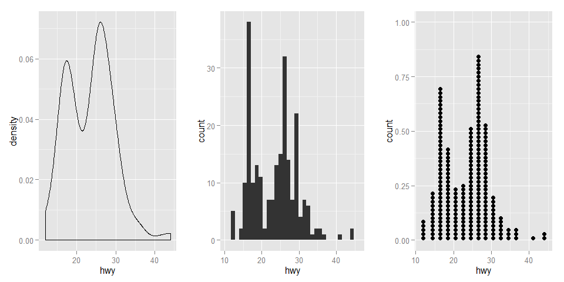 


## Overall relationship between attributes


```r
mpg.num = select(mpg, displ, year, cyl, cty, hwy)
ctab = round(cor(mpg.num), 3)
kable(ctab)
```

          displ     year      cyl      cty      hwy
------  -------  -------  -------  -------  -------
displ     1.000    0.148    0.930   -0.799   -0.766
year      0.148    1.000    0.122   -0.037    0.002
cyl       0.930    0.122    1.000   -0.806   -0.762
cty      -0.799   -0.037   -0.806    1.000    0.956
hwy      -0.766    0.002   -0.762    0.956    1.000

```r
plot(mpg.num)
```

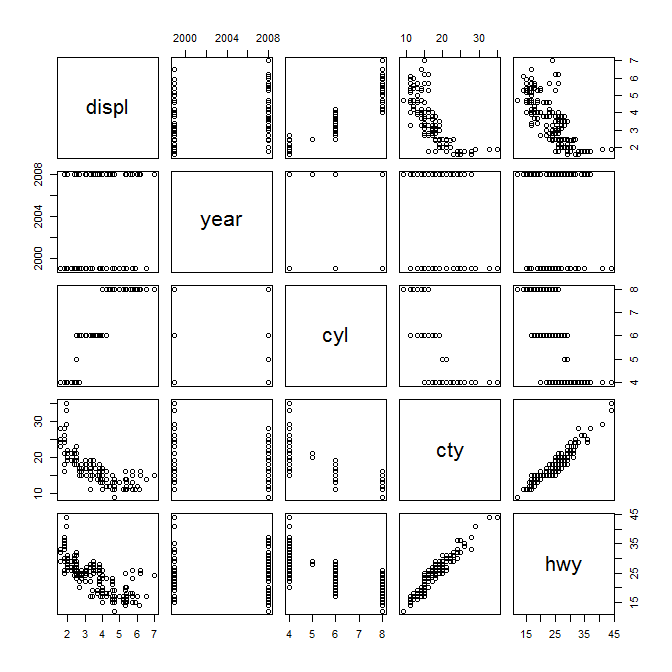 


```r
par(mfrow=c(1,1))
colorfun <- colorRamp(c("#CC0000","white","#3366CC"), space="Lab")
plotcorr(ctab, col=rgb(colorfun((ctab+1)/2), maxColorValue=255),
         mar = c(0.1, 0.1, 0.1, 0.1))
```

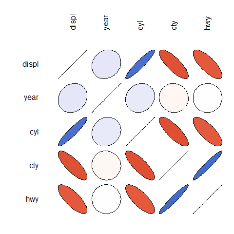 

## Relationship between Two Attributes

### Categorical vs. Categorical Attribute

cyl ~ drv


```r
kable(table(mpg$cyl, mpg$drv))
```

       4    f    r
---  ---  ---  ---
4     23   58    0
5      0    4    0
6     32   43    4
8     48    1   21

```r
par(mfrow=c(1,1))
mosaicplot(table(mpg$drv, mpg$cyl), cex=1.2, main="")
```

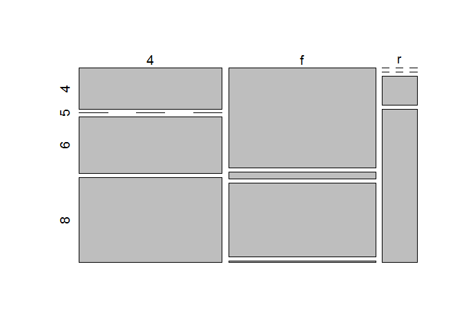 

### Categorical vs. Numerical Attribute


Cylindar ~ MPG


```r
par(mfrow=c(1,2))
plot(jitter(mpg$cyl), mpg$hwy)
boxplot(hwy ~ cyl, filter(mpg, cyl != 5))
```

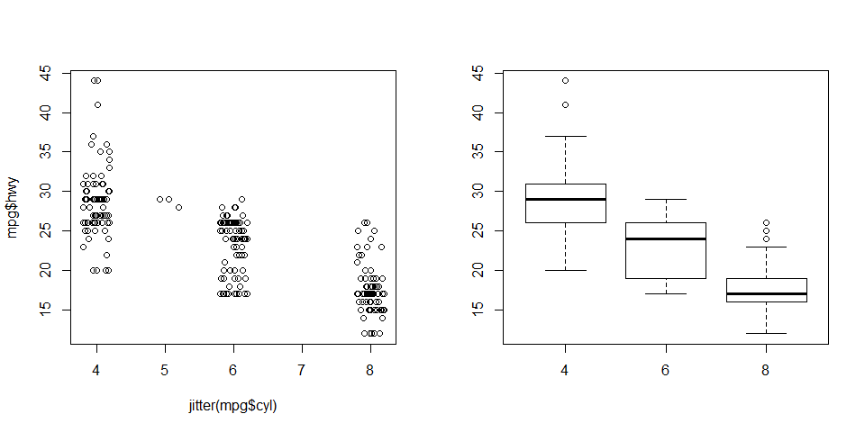 

Hwy ~ Class


```r
par(mfrow=c(1,1))
mpg$class = with(mpg, reorder(class, hwy, mean))
boxplot(hwy ~ class, mpg, varwidth = T)
```

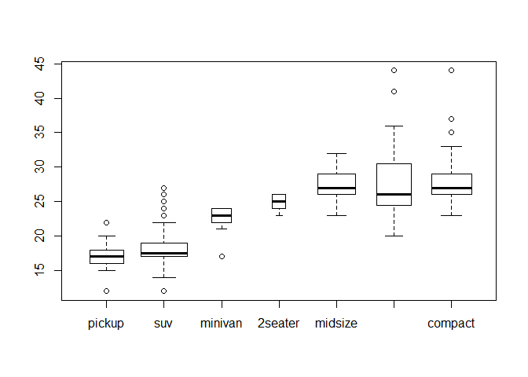 

Year ~ MPG


```r
par(mfrow=c(1,2))
boxplot(hwy ~ year, mpg, xlab="Year", ylab="MPG(hwy)")
plot(jitter(mpg$year), mpg$hwy, xlab="Year", ylab="MPG(hwy)")
```

 


### Numerical vs. Numerical Attribute

How does hwy & cty mpg related?
How does displ & cty mpg related?


```r
par(mfrow=c(1,2))
plot(mpg.num$cty, mpg.num$hwy, xlab = "cty", ylab = "hwy", main = "Cor(cty,hwy)=0.956")
plot(mpg.num$disp, mpg.num$hwy, xlab = "displ", ylab = "hwy", main = "Cor(displ,hwy)=-0.766")
```

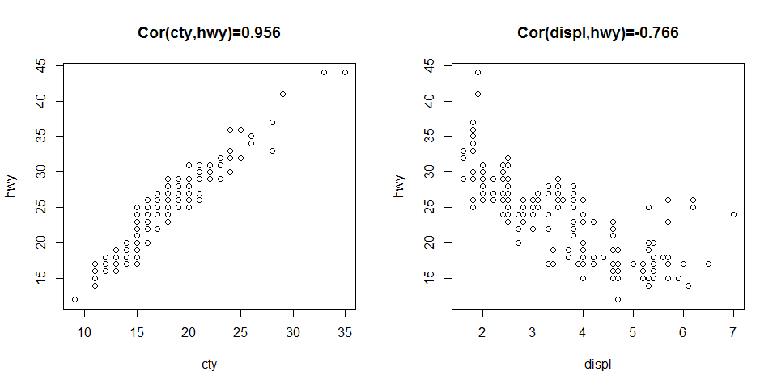 

Adding trend line using ggplot


```r
p1 = ggplot(mpg, aes(hwy, cty)) + geom_point() +geom_smooth()
p2 = ggplot(mpg, aes(displ, cty)) + geom_point() +geom_smooth()
multiplot(p2,p1, cols=2)
```

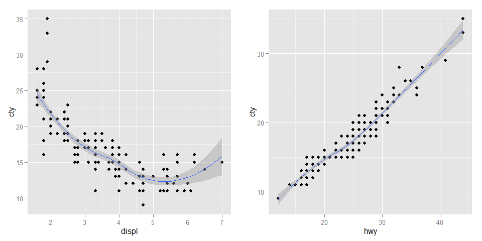 

## Relationship between Multiple Attributes

### What are cylindar & engine related?


```r
ggplot(mpg, aes(hwy, cty)) + geom_point(aes(color = cyl, size = displ))
```

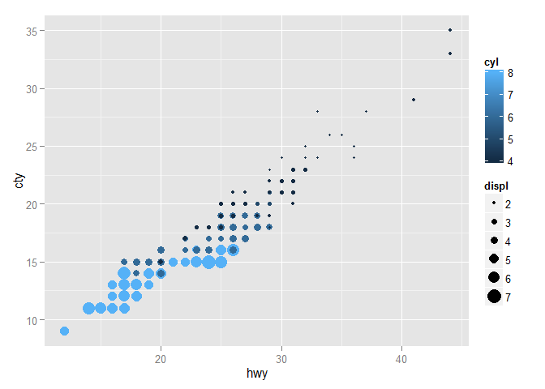 

### MPG per Maker / Model 


```r
majors = group_by(mpg, maker) %>% 
	summarize(count=n()) %>% 
	filter(count > 10)
mpg.majors = filter(mpg, maker %in% majors$maker) %>% 
	distinct(model)

plot.models = ggplot(mpg.majors, aes(hwy, cty)) + 
	geom_text(aes(label = model, color = maker), size = 4, position=position_jitter(width=1, height=2))
plot.models
```

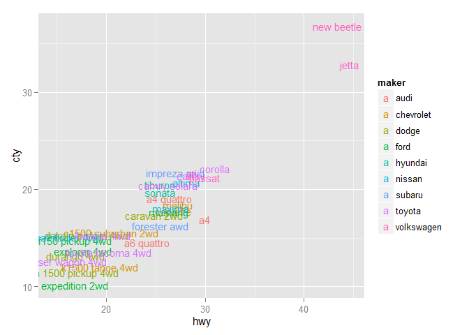 

```r
plot.models.zoom = plot.models + coord_cartesian(xlim=c(15,30), ylim=c(10,25))
plot.models.zoom
```

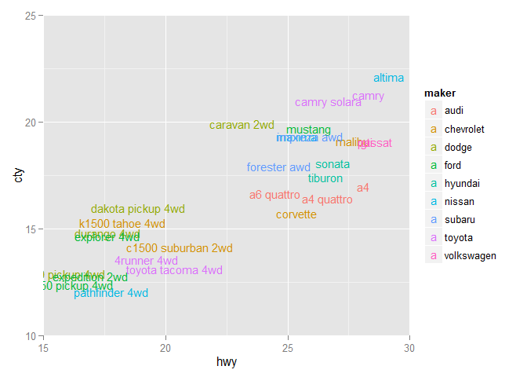 

## Did MPG impri
